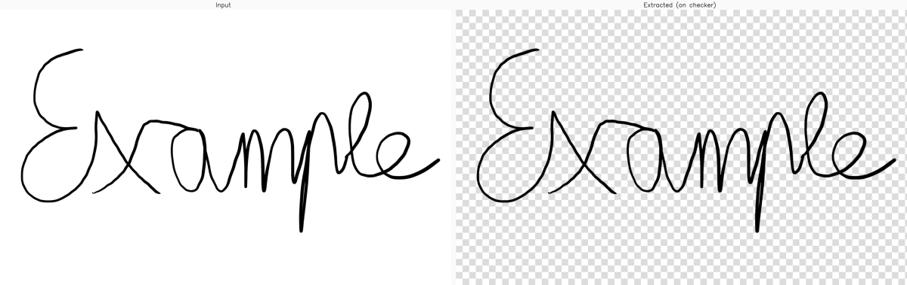

# PNG Signature Extractor

Extract dark ink signatures from light paper and save them as PNGs with a
transparent background. The script estimates uneven paper lighting, isolates
dark strokes by local darkness, removes small paper-texture artifacts, and
renders the signature on a soft alpha channel.



Designed for blue or black ink signatures on light paper, including
high-quality screenshots and photos with mild gray shading or uneven lighting.

## Features

- Single-file or batch processing via CLI flags.
- Accepts `.png`, `.jpg`, and `.jpeg` inputs (grayscale, BGR, or BGRA).
  RGBA images are flattened onto a white background before extraction.
- Removes light paper backgrounds and mild paper texture.
- Renders strokes with a soft, antialiased alpha channel.
- Optional `--preserve-color` flag to keep the original ink color (e.g. blue)
  instead of rendering neutral black.

## Requirements

- Python 3.10 or newer.
- `opencv-python`
- `numpy<2`

## Setup

Create and activate a virtual environment:

```bash
python3 -m venv .venv
source .venv/bin/activate
```

Install dependencies:

```bash
python -m pip install -r requirements.txt
```

If your system Python cannot create virtual environments because `ensurepip` is
missing, you can use `uv`:

```bash
uv venv .venv --python python3.12
uv pip install --python .venv/bin/python -r requirements.txt
```

## Usage

### Batch mode (default)

Place images in `Input/` and run:

```bash
python signature_extractor.py
```

Extracted PNGs land in `Output/` with `_extracted` appended to the original
base name. Custom folders:

```bash
python signature_extractor.py --input-dir scans --output-dir extracted
```

### Single-file mode

```bash
python signature_extractor.py --input photo.jpg --output sig.png
```

### Keep the original ink color

```bash
python signature_extractor.py --preserve-color
```

Run `python signature_extractor.py --help` for the full flag list.

## Project Layout

```text
Input/                  Place source signature images here
Output/                 Extracted transparent PNG files are written here
docs/                   Documentation assets (e.g. example.png)
signature_extractor.py  Main script
requirements.txt        Python dependencies
```

## Configuration

Algorithmic tuning constants live at the top of `signature_extractor.py`:

- `BACKGROUND_BLUR_SIGMA`, `DARKNESS_OFFSET`, `DARKNESS_GAIN`: control how
  aggressively local ink darkness is amplified.
- `NOISE_ALPHA_THRESHOLD`, `MIN_COMPONENT_AREA`: control which small artifacts
  are discarded as paper grain.
- `SOFTEN_KERNEL_SIZE`: smoothing applied to the alpha mask.

## Input Tips

For best results:

- Use a high-resolution image.
- Crop close to the signature before processing.
- Use dark ink on a light background.
- Avoid heavy shadows, ruled paper, complex backgrounds, or very faint ink.

## Limitations

- Ruled or grid paper, complex backgrounds, and decorative borders are not
  handled — the pipeline assumes the only dark content is the signature.
- Very faint ink (light gray pencil, dried-out pen) may fall below the
  darkness threshold and be removed as noise.
- The extraction always renders strokes in a single color (black by default,
  or the source color with `--preserve-color`); ink-color gradients are not
  preserved per pixel.
- Tuning constants are absolute pixel values; behavior may vary across very
  different image resolutions.

## History

The original version of this project used the `rembg` library and its
pre-trained U²-Net background-removal model. The current script replaces that
with a lighter OpenCV pipeline that runs without a deep-learning runtime and
handles uneven paper shading more predictably.

## License

This project is licensed under the MIT License.

## Author

Yannik Trinn
